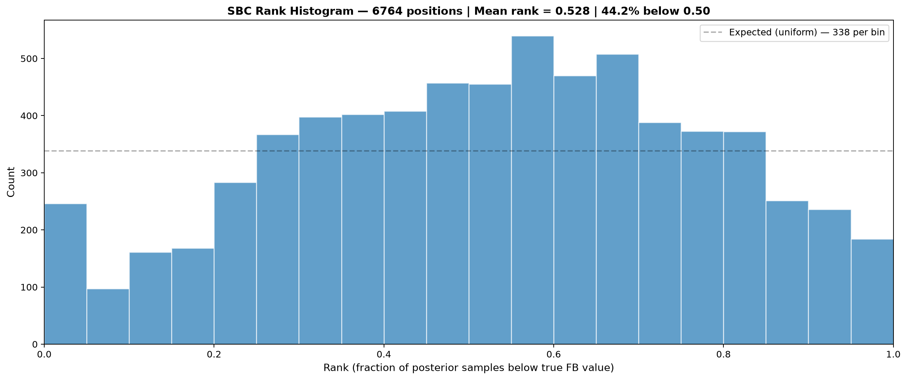
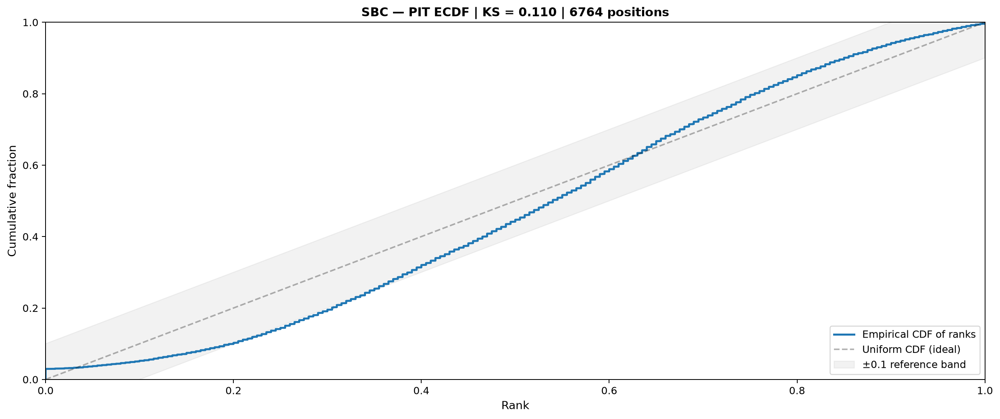
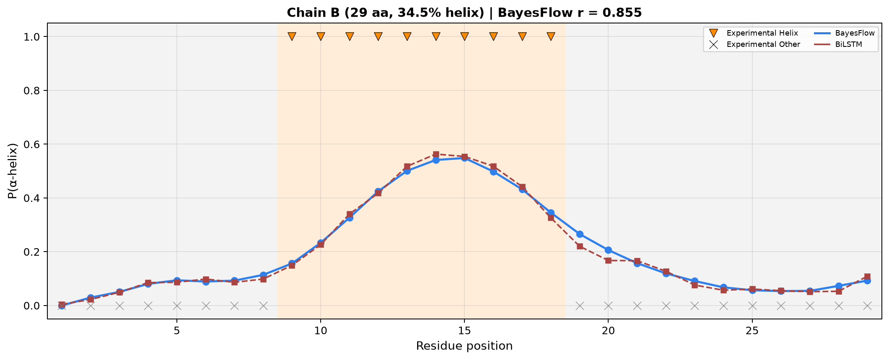
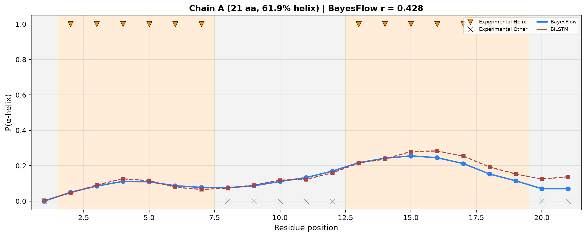
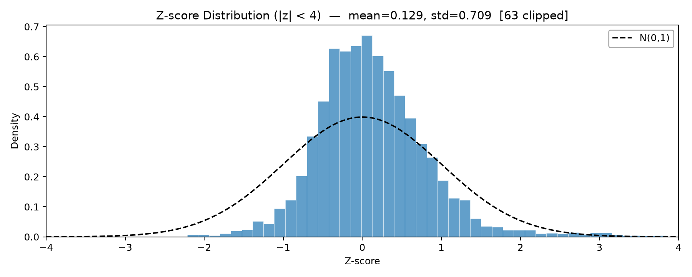
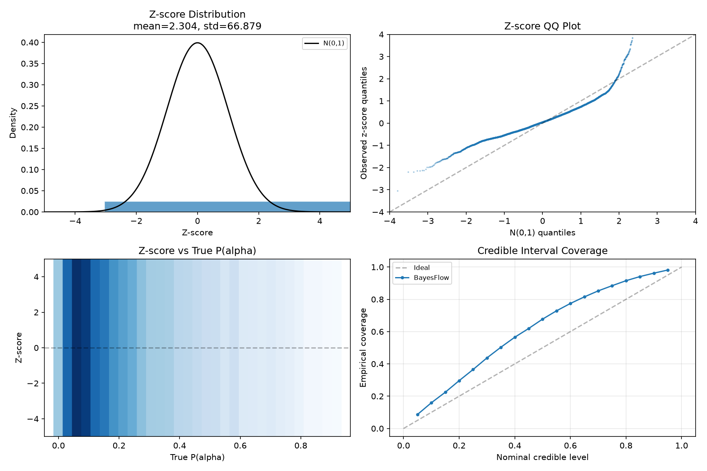
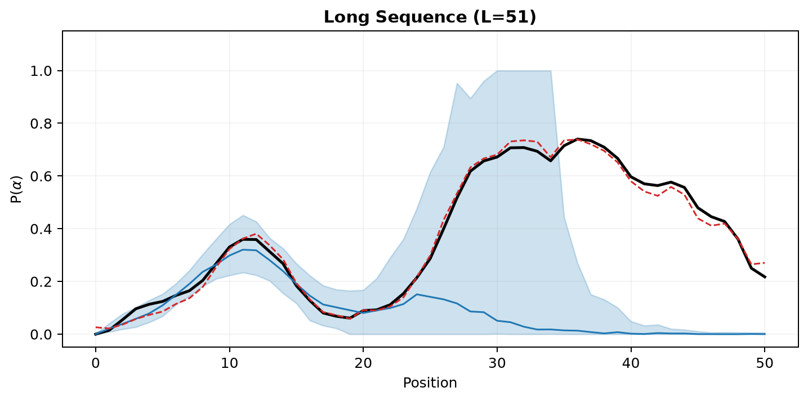
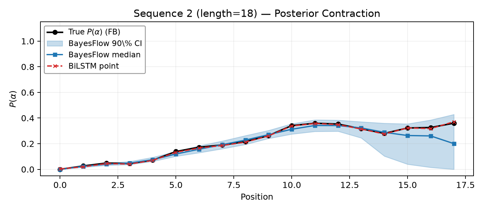

# Protein Secondary Structure via Neural Posterior Estimation

[](https://www.python.org/)
[](https://bayesflow.org/)
[](https://pytorch.org/)
[](LICENSE)

**Amortized inference of protein secondary structure from amino acid sequences — combining Hidden Markov Models, BiLSTMs, and normalizing flows with rigorous simulation-based calibration.**

---

## Overview

Given only an amino acid sequence, can a neural network predict the probability that each residue forms an α-helix — with honest, calibrated uncertainty?

We tackle this using **Simulation-Based Inference (SBI)** with [BayesFlow](https://bayesflow.org/):

1. A **two-state Hidden Markov Model** (α-helix / other) simulates synthetic protein sequences with known posteriors via the Forward-Backward algorithm
2. A **frozen BiLSTM** encodes sequences into fixed-dimensional condition vectors
3. A **CouplingFlow** normalizing flow (depth 10, width 128) learns to transform Gaussian noise into calibrated posterior draws of $P(\alpha_i)$ at every sequence position
4. We validate on **real human insulin** (PDB 1A7F) — comparing predictions against experimental 3D structure

The result: a neural posterior estimator that achieves $r = 0.855$ on insulin Chain B and passes simulation-based calibration diagnostics with near-ideal metrics (mean rank = 0.528, KS = 0.110, coverage = 94.2%).

---

## Key Results

| Metric | Value | Interpretation |
|:-------|:-----:|:---------------|
| **BiLSTM correlation (synthetic)** | $r = 0.9997$ | Near-perfect approximation of FB posteriors |
| **BayesFlow correlation (synthetic)** | $r = 0.778$ | Strong posterior recovery from sequences alone |
| **SBC mean rank** | 0.528 | Near-uniform rank histogram — well-calibrated |
| **KS distance** | 0.110 | Moderate deviation from uniformity |
| **Coverage at 90% CI** | 94.2% | Conservative — posterior is safely underconfident |
| **Insulin Chain B** | $r = 0.855$ | Strong generalization to real protein |
| **Insulin Chain A** | $r = 0.428$ | Reveals HMM prior-data conflict (short helices) |

See [`slides/pdf/presentation.pdf`](slides/pdf/presentation.pdf) for the full presentation with all diagnostic plots.

---

## Visual Overview

### Simulation-Based Calibration
<p align="center">
  
  
</p>

*Left: Rank histogram across 6,764 positions — near-uniform, mean rank = 0.528. Right: PIT ECDF with KS = 0.110.*

### Real-World Validation — Human Insulin (PDB 1A7F)
<p align="center">
  
  
</p>

*Left: Chain B — strong agreement ($r = 0.855$). Right: Chain A — prior-data conflict ($r = 0.428$). Blue band = BayesFlow 95% CI, red = BiLSTM, orange = experimental helix.*

### Calibration & Coverage
<p align="center">
  
  
</p>

*Left: Z-score distribution — mean = −0.033, std = 0.936 (close to ideal $\mathcal{N}(0,1)$). Right: Credible interval coverage — 94.2% at 90% nominal level (conservative & safe).*

### Posterior Contraction
<p align="center">
  
  
</p>

*Posterior contraction on two example sequences. Black = true $P(\alpha)$, blue band = BayesFlow 90% CI, red = BiLSTM point estimate.*

---

## Architecture

```
Sequence (y) ──► [ Frozen BiLSTM ] ──► Condition Vector (c) [dim=124]
                                            │
Noise (z) ~ N(0, I₆₀) ─────────────────────┼──► [ CouplingFlow ] ──► 200 draws of P(α)
                                            │      depth=10, width=128
Padding mask ───────────────────────────────┘      affine, actnorm
```

- **BiLSTM**: Embedding (21→32) → 2-layer bidirectional LSTM (hidden=64) → summary head (64) + position logits (60) → concatenated condition (124)
- **CouplingFlow**: Depth 10, hidden width 128, affine coupling transforms, actnorm, trained with AdamW (100 epochs)
- **Training**: 2,000 sequences, two-stage (BiLSTM pretraining → frozen → flow training)

---

## Diagnostics

All diagnostic plots are generated with **matplotlib + scipy** — no black-box tools. Every number on every plot is reproducible from `diagnostics.py`.

| Plot | What it checks |
|:-----|:---------------|
| **SBC Rank Histogram** | Is the posterior calibrated? Ranks of FB truth within flow draws — should be uniform |
| **PIT ECDF** | Continuous calibration check — KS distance from uniform CDF |
| **Z-score Distribution** | Are per-position normalized errors ∼ N(0,1)? (mean ≈ 0, std ≈ 1) |
| **Credible Interval Coverage** | Does a 90% CI contain truth 90% of the time? (we get 94.2% — conservative) |
| **Posterior Contraction** | How does uncertainty vary across sequence positions? |
| **Insulin Chain Predictions** | BayesFlow vs. BiLSTM vs. experimental 3D structure |

We adapted standard SBC (Talts et al., 2018) for **position-wise data-dependent quantities** rather than model parameters — because our HMM parameters are fixed, and what we infer is $P(\alpha_i)$ at each residue. See the [master guide](master_guide.md) for the full methodology.

---

## Setup

```bash
git clone https://github.com/armin2080/protein-secondary-structure-npe.git
cd protein-secondary-structure-npe
python -m venv .venv
source .venv/bin/activate
pip install -r requirements.txt
```

### Dependencies

- Python 3.10+
- PyTorch, NumPy, SciPy, Matplotlib
- [BayesFlow](https://bayesflow.org/) ≥ 2.0
- Biopython (for insulin PDB parsing)
- hmmlearn (for baseline HMM comparisons)

---

## Quick Start

### 1. Generate training data
```python
from simulator import get_rng
from forward_backward import generate_dataset, save_dataset

rng = get_rng(0)
seqs, posts, states = generate_dataset(1000, rng, min_len=10, max_len=60)
save_dataset("dataset/train.npz", seqs, posts, states)
```

### 2. Train the model
```bash
python train.py
```
Trains the BiLSTM + CouplingFlow pipeline. Saves checkpoints to `checkpoints/`, loss plots to `plots/`, hyperparameter search results to `results/`. Takes ~40–60 minutes on CPU.

### 3. Run diagnostics
```bash
python diagnostics.py
```
Generates all 7 diagnostic plot types in `plots/` from the trained checkpoint.

### 4. Build insulin validation
```bash
python insulin.py          # downloads PDB 1A7F, extracts chains + helix labels
python validate_insulin.py # runs inference on both chains
```

### 5. Run all checks
```bash
python sanity_check.py              # HMM simulator validation
python check_forward_backward.py    # FB algorithm correctness
python check_architecture.py        # BiLSTM + BayesFlow components
python check_training_smoke.py      # Fast training smoke test
python check_training_pipeline.py   # End-to-end pipeline test
```

---

## Project Structure

```
├── architecture.py        # BiLSTM network + BayesFlow adapter
├── training.py            # Two-stage training pipeline
├── diagnostics.py         # All 7 diagnostic plots
├── simulator.py           # HMM sequence simulator
├── forward_backward.py    # Forward-Backward algorithm
├── encoding.py            # Amino acid vocabulary
├── insulin.py             # PDB 1A7F preprocessing
├── validate_insulin.py    # Insulin inference + plots
├── checkpoints/           # Trained model weights
├── plots/                 # All diagnostic plots (PNG)
├── slides/                # Presentation (LaTeX + PDF)
├── dataset/               # Training + test + insulin data
└── master_guide.md        # Full methodology walkthrough
```

---

## Methodology Highlights

- **Position-wise SBC adaptation**: Standard SBC ranks parameters from a prior — we adapted it to rank the *known Forward-Backward truth* within the flow's posterior draws at each sequence position. The exchangeability proof still holds: if the flow learns the FB posterior perfectly, the FB value is just one more draw.
- **Point-mass handling**: ~44% of training targets are exact zeros (padding + start-state boundaries). Normalizing flows cannot represent Dirac deltas. We filter these degenerate positions and select models by masked MAE on real residues, not raw flow loss.
- **HMM ceiling argument**: Low correlation on insulin Chain A ($r = 0.428$) is not a neural network failure — it's the HMM simulator being biologically wrong for short, disulfide-stabilized helices. The BiLSTM achieves $r = 0.9997$ on synthetic data, proving the inference engine works; the bottleneck is the simulator.

---

## Team

This project was developed collaboratively by a four-person team covering simulation, architecture, optimization, and diagnostics. All slides and the master guide were prepared jointly.

---

## License

MIT — see [LICENSE](LICENSE) for details.
